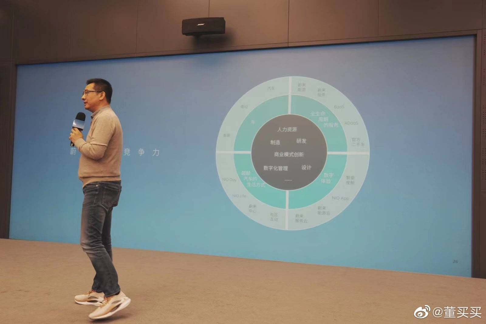
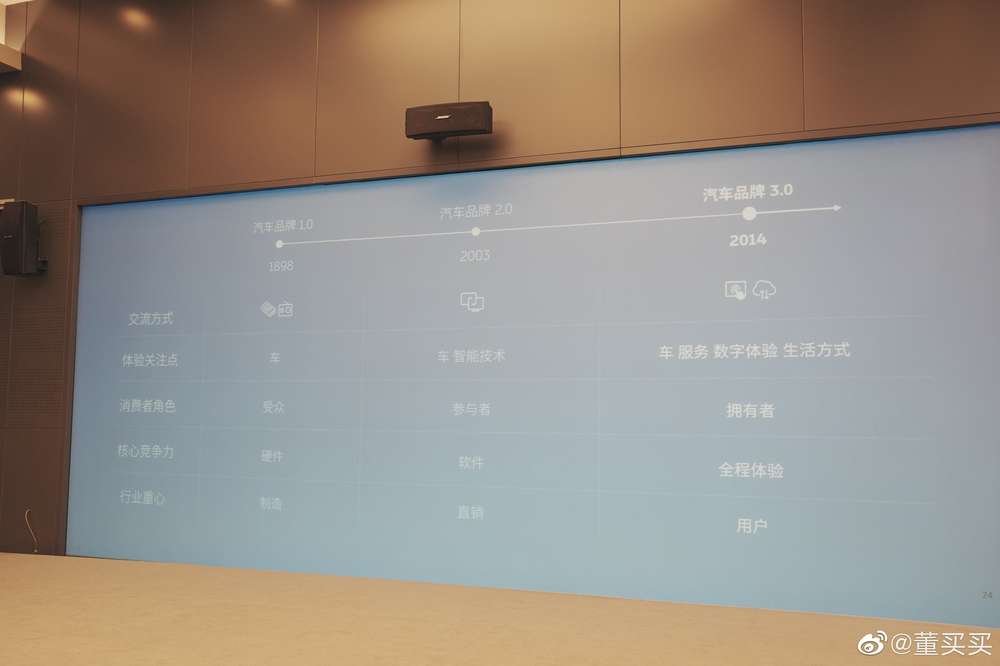

# NIO

[IR Website](https://ir.nio.com/)

### 李斌

- 蔚来不会花钱请人来代言做广告，如果名人要给蔚来做广告，先把蔚来车买了。用户导向的企业，应该由用户来代言，参考苹果的广告。
- 蔚来直接走高端的好处： 
  1. 直接做高端会更有竞争力，税收的原因，电池成本的考量。
  2. 高端车可以用最新的技术 
  3. 传统豪华品牌针对中国市场做的创新比较少，速度比较慢，给蔚来很多机会。
  4. 中国市场的消费升级，中国人消费水平已经不是10-20年前的水平了。85-90后对国外品牌已经没有太多仰视。
- 创新不只是产品技术（地基），也可以从产品体验，商业模式
- 蔚来最难的时候，没有投资机构救它，只有政府看的比较长远，合肥政府雪中送炭，并且获得很好的回报。
- 如果是用户企业，它关注的是用户体验是否足够好，它不是看这个服务包能挣多少钱，只要这个不太亏钱，用户用的爽，能维持住就好。亚马逊对物流的投入，并不是想在物流上挣用户的钱。
- 当销量，保有量很低的时候，毛利也很差，单个用户服务包亏损也很大。即使十几个用户，也需要全套服务。随着用户增长，服务投入相对会降低，加上互联网，云的智能精准安排一键无忧，更高的服务效率，长期会使企业拥有宽的护城河。
- 企业的成功来自价值创造，迪斯尼为用户创造了快乐，苹果为用户带来了科技人文的价值，亚马逊高效物流，购物体验。蔚来的价值创造在于如何高效的给用户带来不一样的体验。汽车产品，服务，数字化，以及汽车之外的生活体验。
- 汽车，服务有合理的利润，甚至不赚钱都可以。Beyond the car却可以多赚钱。修车保养就好比人生病要去医院，你就算修的再完美，保养的再好，没人开心。但是买蔚来的衣服，包包，是开心的事情，用户并不会介意支付额外的溢价。
- 用户企业是否会成为护城河？别的企业copy你们的做法能不能成功？有竞争是好事，可以push自己成长，如果只是汽车和自动驾驶，并没有很高的壁垒，再过几年自动驾驶可能就是标配了。中国一年2000w辆车，有钱进来，给点时间就能做。但是关乎人心的事情是特别难的，都说星巴克不错，迪斯尼不错，给你钱，你能做么？用户企业一定是烙印在骨子里的文化，上下里外都需要践行的。理念从说到懂，到信，再到做每个环节都会被稀释很多。
- 智能电动汽车，是能源，智能，互联网的全面创新融合。再有4-5年，就可能会出现车的终极形态，好比07-08年的iphone。
- 设计三大部门（软件，硬件，外观内饰？），会使得部门之间沟通特别难，好比爬一座大山，再下来，再爬另一座山。组织扁平化，沟通部门充分授权。CEO属于交响乐的指挥，让各部分协同工作。
- 越需要及时迭代更新反馈的东西，越需要自己做。你离用户近，快速通过软件升级，提升用户体验。如果中间隔着其他供应商，就会很难。
- 代工合作制作？投资2个亿在南京建造试制造工厂。用来验证工艺，培训技师，这样大工厂还在建造的时候，甚至之后的规模量产的时候，心里就会有底。
- 所谓的垂直整合并不一定总有道理，核心点在于，你做这件事是否有附加值，如果一个随处可以买到的芯片，你非要自己做，做了很大的投入，不一定能有很好利润回报和附加值。（资本的利用率很重要）
- 如果给蔚来定一个目标，希望是全世界用户满意度最高的公司。基于这个，你必须有领先的技术，好的产品，好的服务，用户体验是好的。

### 秦力洪
- 首先要知道消费者绝对不会为纯情怀买单，汽车是物理产品，这个产品承载着大家的生活方式、生活效率甚至是家人的生命安全，所以一定是底子硬、内核硬的技术产品。其次，汽车到了一定档次上，在物理需求之外，人们感性需求的比例会增大，比如说被尊重、便捷服务等。消费者选择蔚来，肯定是基于物理和情感双重因素的需求，其中产品技术、品牌、社区氛围的影响都有，要持续地做好高端品牌，在这三个方面的发力缺一不可。
- 100年前，路上都是马车，汽车加油要甚至靠马车拉着油桶。那时候也有电动车，但是最终由于石油开采，加油的普及战胜了电车。福特的杰出贡献不光是T型车系列，更重要的是游说美国两会布局加油站。今天中国北方平均每5000平方公里才有充电桩，这样的基础设施是不足以推广电动车的。历史总是惊人的相似，蔚来当下做的（布局换电站，超冲桩，Power North），和100年前油车前辈们没什么不同。
- 有的车企秋天来了不筑巢，总觉得冬天来了可以躲。可见的将来，不做能源服务的电动车企业，都是机会主义者
- 如果只是交通工具，租车就行。有丰田这样高效车企就行。车是承载个人生活方式价值定位的产品；
-（经营企业）个人层面靠用心，组织层面靠价值观；
- 销售可以是短期行为，也可以是长期行为，我们要思考fellow回到fellow的本意（美国大学的教授，fellow本意志同道合，长期陪伴）；
- 2014年蔚来成立，理想小鹏差不多也是14、15年。回过头看，1994年也是神奇的一年，很多现在的500强，也是当年成立的。历史是有窗口的，不是长流水；
- 正面回应社区内不同的声音：这几年来，大量蔚来不好的消息，大多是来自蔚来app。蔚来的负面，来自蔚来是社区，这是力量的体现，自信的体现。我们坚持做透明开放社区，基本方向不会改变。只要你不违法、不违反基本商业道德….蔚来社区正在展现多样性…这样一个社区，追求没有矛盾，只可能文过饰非。所以，很正常，是客观事实。这是对我们团队的考验。
- 正面回应座椅事件，（座椅）这个事成了事，是我们社区优越的地方。普通人的关切可以成为公共话题，并成为公司决策一部分。试问还有哪个企业可以做到？一个椅子兼容所有人群身材，别的企业不满意，你有渠道去反馈么？
- 聊到要创立的子品牌，差异过于大的用户，我们要建不同的社区；
- 当前新能源汽车鱼龙混杂，有的新能源车为了一块绿牌，不是真正体验环节、能源升级环节；
- 我们电机（自研），再花点钱可以110kW干到400kW，买菜车到超跑都能自己干；
- 挪威95%用户是BaaS，国内没这么做，是因为现有换电，才有BaaS。不过总有一天，免费换电模式会和BaaS强挂钩；
- 明年上半年，电池要做到可以跨级别换电。一定会到1100个换电站的，比2020年大概晚一年半；
- 最后就是这张PPT，下午2个多小时都围绕这张图在说。看明白了这张图，我觉得蔚来以后要做什么，不做什么，应该很清晰。
- 蔚来想盈利很容易，最新一期财报，卖车的利润已经足够cover三费中二费了，亏的是研发，研发从战略角度上，就用融资去填。这就像培养一个孩子，你指望他7岁赚钱么？会觉得7岁投入教育的费用“不能回本”不投入了么？
- 你觉得蔚来那些“不务正业”的业务，什么搞牛屋、办活动、搞NIO Life，你没发现越来越多企业开始试着Copy了么？你没发现，只copy一个外观是不够的么？这些东西，随着时间，都会转化为NIO的价值。

### 自己的感悟
- 参照京东的成功，好的物流解决的痛点是如何快速将物品送到消费者手里。当时高瓴投资京东时，看到了很远以后这种强大物流带给消费者的好处。可是这个前期投入是巨大的，如果目光太短，聚焦于盈利，是不可能成功和做出这样的投资决定。同样蔚来的换电站也是为了解决用户充电的痛点，无论充电桩如何快，电车用户依然要等很久。虽然建造换电站前期需要巨额投入，甚至要亏本运营，可是放长远看，未来带给消费者的价值是巨大的。Power North等这些长久规划，未来一定会给蔚来创造北方地区的先发优势和深厚的护城河。假以时日，盈利的爆发性增长也是可期的。
