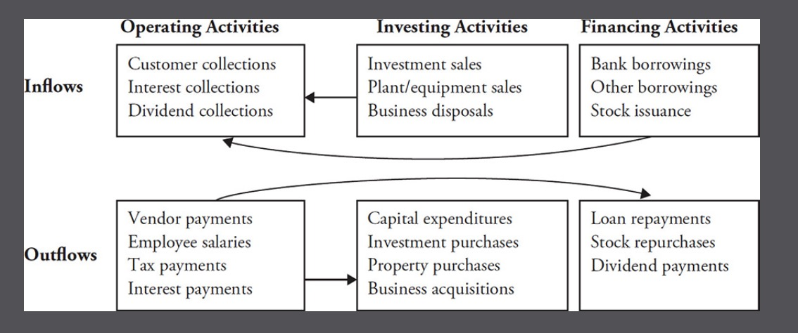

# Financial Shenanigans

### Earnings Manipulation

#### Inflating Current-Period Earnings (push more revenue into the current period or shift expenses to a later one)
1. Recording revenue too soon
2. Recording bogus(fake) revenue
3. Boosting income using one-time or unsustainable activities
4. Shifting current expenses to a later period.
5. Employing other techniques to hide expenses or losses

#### Inflating Future-Period Earnings (hold back today's revenue, accelerate tomorrow's expenses or loss into the current period)
1. Shifting current income to a later period
2. Shifting future expenses to the current period

#### Boomerang Transcation
1. When money flows in both directions, from seller to customer and from customer to seller.
2. The suspicious timing of press releases announcing new sales just after a period ended, as revenue should be recognized when earned, not at the point of signing a contract. 

#### Calendar Games
Be wary of companies that extend their quarter end date. 

#### Changing Accounting Policies to Keep the Streak Alive
When senior executives boast about an amazing record streak of performance, it is more likely that they will resort to financial shenanigans to keep that streak alive.

#### Percentage of Completion(POC)
When a company switches from standard revenue recognition practices to the more aggressive POC approach. Investors should be alert. 

#### Be alert for Up-Front Recognition of a Long-term License Contract
#### Watch for Shipping Product to an Intermediary, Rather Than the Actual Customer
#### When a company switches from the more conservative sell-through(to actual users) to the sell-in(to a distribution network) approach, which of course inflates sales
#### A rapid increase in accounts receivable is often an indication of deteriorating financial health

1. Be extremely cautious when a company reports barter(易货贸易) or "nonmonetary" sales, especially when the buyer is a related party. Goods and services are swapped between two related parties. 
2. Question Revenue Recorded when cash is received in lending transacations, never confuse money received from your banker with money from a customer. 
3. Turning the sale of a business into a recurring revenue stream. A phone manufacturer decides no longer make its own batteries may sell its battery manufacturing division to another company and purchases batteries from that later. 

### Techniques to shift current expenses to a later period
1. Excessively capitalizing normal operating expenses
    - Unwarranted improvement in profit margins and a large jump in certain assets
    - A big unexpected decline in free cash flow, with an equally sizable increase in cash flow from operations
    - Unexpected increases in capital expenditures that belie the company's original guidance and market conditions
    - A new or unusual asset account, particularly one that is increasing rapidly, may signal improper capitalization
3. Amortizing costs too slowly
    - management decides to lengthen the amortization period.
5. Failing to write down assets with impaired value
    - compare the growth of inventory with revenue growth. If inventory growth far exceeds the sales growth, the inventory bulge is probably unwarranted and a concern for investors
    - watch for a decline in bad debts expense, previously has a lot of bad debts, now reduced a lot.
7. Failing to record expenses for uncollectible receivables and devalued investments

#### After buy Insurance policy, it is a asset at begining, then every year as expense from income statment, reduce the asset. 

#### Always view receive cash from vendors with suspicion. Cash normally flows out to vendors, not in from vendors. 

### Shift current income to a later period
1. Creating reserves and releasing them into income in a later period(deferred earnings)
2. Smoothing income by improperly accounting for derivatives
3. Creating reserves in conjunction with an acquisition and releasing them into income in a later period
4. Recording current-period sales in a later period, fails to record revenue during the current period, storing it on the balance sheet until it is needed.
5. accelerating expenses to earlier periods 

#### A Big Bath
Clean up the mess, look like a strong, decisive leader, a large write-down of assets. Makes showing earnings growth in future periods infinitely easier. 

#### Restructuring events should not become a regular occurrence. 

### Cash flow shenanigans
1. Shifting financing cash inflows to the operating section
2. Moving operating cash outflows to other sections
3. Boosting operating cash flow using unsustainable activites

1. High net income with low cash flow for operating often signals the presence of some earnings manipulation.
2. Bogus revenue might also signal bogus CFFO
3. Selling accounts receivable
    - Factoring, sell to bank
    - Securitization, issue stocks
4. Investors should focus not only on how much CFFO grew, but also on how it grew. 
5. It is well worth your time to look for changes in disclosure each quarter, particularly in the most important sections of the filings. Most research platforms and word processing software have "word compare"
6. Techniques to move cash outflows to other sections
    - inflating CFFO with boomerang transactions
    - improperly capitalizing normal operating costs
    - Recording the purchase of inventory as an investing outflow
    - Shifting operating cash outflows off the statement of cash flows.
7. Free cash flow = operations - capital expenditures
8. Techniques to boost operating cash flow using unsustainable activities
    - Boosting CFFO by paying vendors more slowly
    - Boosting CFFO by collecting from customers more quickly
    - Boosting CFFO by purchasing less inventory
    - Boosting CFFO with one-time benefits
9. If you see a discussion of accounts payable that is longer than a couple of sentences, there is probably something in there that you want to know.(e.g. accounts paybale financing arrangements)
10. Check 10-Q,10-K Management Discussion and Analysis, **Liquidity and Capital Resources** section is a must-read for every company. 
11. Two Key Metric Shenanigans
    - showcasing misleading metrics that overstate performance
    - Distorting balance sheet metrics to avoid showing deterioration

12. Know key metrics for your company, bottles sell for coke, car sales for automaker, GMV for e-commerce, subscribers count for cable company and etc.
13. Bad company will try to dress up their results by routinely adjusting their definition of key metrics(e.g. Same store sales)
14. Churn: the level of cancellations for cable/internet company. 
15. Beginning backlog + net bookings - revenue = ending backlog
16. For capital-intensive business, EBITDA is often a misleading measure of performance and profitability because all the major capital costs run through the income statement as depreciation and they are excluded from EBITDA. 
17. Techniques to Distort Balance Sheet Metrics to Avoid Showing Deterioration
    - Distorting accounts receivable metrics to hide revenue problems
    - Distorting inventory metrics to hide profitability problems
    - Distorting financial asset metrics to hide impairment problems
    - Distorting debt metrics to hide liquidity problems
18. Whenever you spot a CFFO boost from the sale of receivables, also realize that by definition, the company's DSO will have been lowered as well.
19. As an investor, you should cringe when you see a company having a public disagreement with its auditor, particularly on a shady transaction of significant magnitude.
20. Three Acquisition Accounting Shenanigans
    - Artificially boosting revenue and earnings
    - Inflating reported cash flow
    - Manipulating key metrics
21. Acquisition Accounting Techniques to Artificially Boost Revenue and Earnings
    - Inflating profits through tricks at a target company before a deal closes
    - Inflating profits by hiding losses at deal closing
    - Creating dubious new revenue streams after closing
    - Inflating profits by releasing suspicious reserves either before or just after closing
22. For company is acquired, the parent company might want child to pay bill down ASAP or prepay more than they should. Hold revenue not report or deposit. This way parent company can report more revenue after merge.
23. Free cash flow after acquisitions is a userful measure of cash flow when analyzing serial acquirers.
24. If the non-GAAP metric continually produced A+ results and the GAAP-based equivalent produced D- results, investors should reject the non-GAAP metric. 
25. When a company is in the process of correcting past accounting errors, smart investors will stay away until they have the chance to analyze the company's true performance. There is a good chance that the corrected numbers and underlying business performance will be worse than expected. 
26. 

