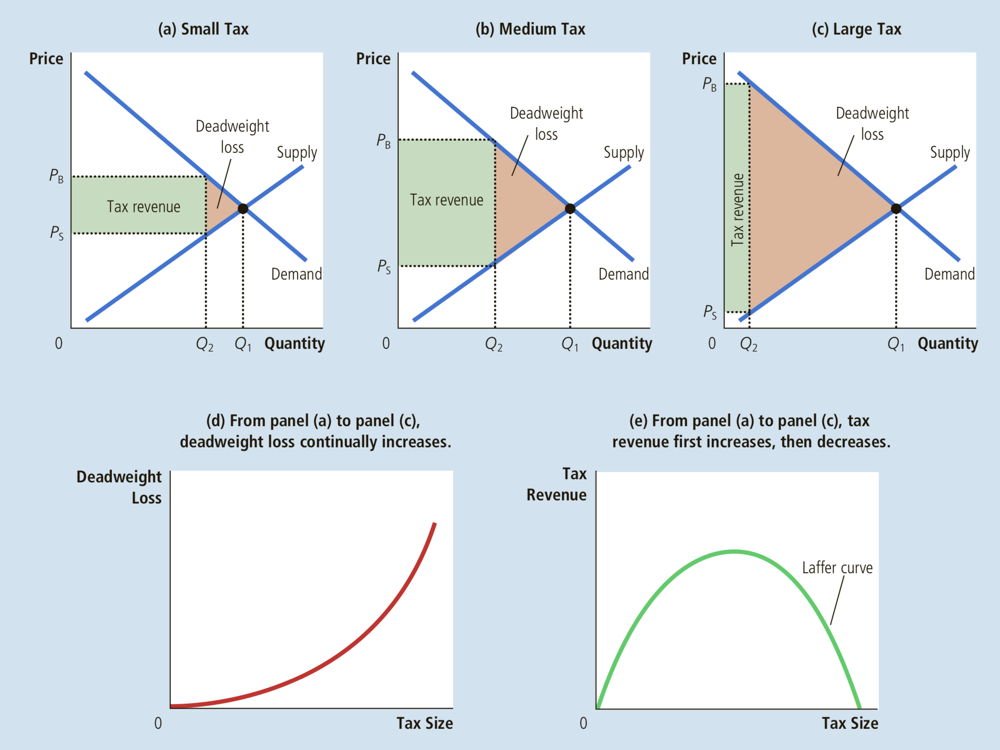

# Principles of Microeconomics

1. **Economics**, comes from the Greek word oikonomos, which means "one who manages a household", the study of how society manages its scarce resources. 
2. **Efficiency**, the property of society getting the most it can from its scarce resources. The greater the efficiency, the bigger the pie.
3. There is trade-off between efficiency and equality. Government policies could aimed at equalizing the distribution of economic well-being(welfare system, unemployment insurance). This means higher tax for rich and reduces the reward for working hard, reduce the efficiency, the pie get smaller. 
4. Rational people often make decisions by comparing marginal benefits and marginal costs. When you pay fix cost $40/month for phone service and $0.5/minute for every phone call, $0.5 is your marginal costs, $5 for 10 minutes call is your marginal benefits. 
5. Governments responsibilities: 
    - enforce property rights so individuals can own and control scarce resources
    - when market failure(externality, the impact of one person's actions on the well-being of a bystander), pollution is an example. 
    - stop monoploy, single person or firm to unduly influence market prices. 
6. Cigarette lighters don't cause cancer(omitted variable), minivans don't cause larger families(reverse causality)
7. Although it is possible for one person to have an absolute advantage in both goods, it is impossible for one person to have a comparative advantage in both goods. Because the opportunity cost of one good is the inverse of the opportunity cost of the other, if a person's opportunity cost of one good is relatively high, the opportunity cost of the other good must be relatively low. 
      - Sports star can film a TV commercial in 2 hours and earn $30,000 or mow his lawn 2 hours. To lawn his backyard, the opportuity cost($30,000) is pretty high. Forrest Gump can mow his lawn in 4 hours, in that same 4 hours, Forrest could work at McDonald's and earn $50. Forrest has a comparative advantage in mowing lawns. If sports star willing to pay between $50-$30,000 for Forrest mow his lawn, both of them will be better off.  
8. When minimum wage rises, some teenagers who are still attending high school choose to drop out and take jobs. 
9. Taxes discourage market activity. When a good is taxed, the quantity of the good sold is smaller in the new equilibrium. 
10. Buyers and sellers share the burden of taxes and a tax burden falls more heavily on the side of the market that is less elastic. A new luxury tax on yachts might cause rich people buy other stuff, go golfing, take a vacation. However, the yachts factory, middle workers are suffer more of the tax burden. 
11. Deadweight losses(Tax issue), Mike opportunity cost $80, Mei's time opportunity cost $120, When Mei hire Mike to clean her house for $100, the total surplus is $40. When you add $50 tax for cleaning services. There is no price for deal to happen, socity total lost $40 surplus, everyone become worse. Tax prevent buyers and seller from realizing some of the gains from trade. 
12. The Laffer Curve indicate the heavy tax, more deadweight loss and less tax revenue. the little tax, less deadwight loss, little revenue. Somewhere in the middle might be the best. 

14. When a country allows trade, trade raises the economic well-being of a nation in the sense that the gains of the winners exceed the losses of the losers. An exporter of a good, domestic produces of the good are better off, and domestic consumers of the good are worse off. verse vice. 
15. Tariff raises the domestic price, domestic sellers are better off and domestic buyers are worse off, in addition, the government raises revenue. 
16. Import quota creates surplus for those who obtain the licenses to import, it's similar to tariffs if the government charges a fee for the import licenses. 
17. Arguments for restricting international trade:
    - destroys domestic jobs, there are new jobs will be created, it hurts short-term, but economic well-being make them rich and retrain, investing in other areas they have comparative advantage.
    - national-security, be wary this argument is made by representatives of industry rather than defense establishment. Companies have an incentive to exaggerate their role in national defense to obtain protection from foreign competition. 
    - Infant industry need temporary trade restrictions. China Internet companies. It is difficult to implement in practice, governement need to decide which industries will eventually be profitable. "picking winners" is extraordinarily difficult. It's hard to remove the reward or protection once those infant grow up, because they have more influence on the government. Infant should willing to suffer short term losses, instead of rely on protection.
    - Unfair-competition, sales thing cheaper than average cost, this is like government subsidy the other countries consumers. Be careful of Air Bus, Boeing, government subsidy them and monoploy in the world will create advantage in long term. 
    - The protetion as a bargaining chip, trade restrictions can be useful when bargain with our trading partners. Threat of a trade restrction can help remove a trade restriction already imposed by a foreign government. The problem with this is that threat may not work. If it doesn't work and still carry out its threat, this reduce its own economic welfare. If back down from its threat, it lose prestige in international affairs. 
18. The different kinds of goods: excludable(private or public)? rival in consumption(one person use of the good, reduce another person's ability to use it)?
19. Important Public Goods, determining the appropriate level of government support is difficult, because the benefits are hard to measure. The person decide funds have little expertise.
    - National Defense
    - Basic Research
    - Fighting Poverty
20. The reason for tragedy of the commons(pollution, over graze) is that social and private incentives differ.
21. Why does the commercial value of ivory threaten the elephant, while the commercial value of beef protects the cow? Elephants are a common resource, whereas cows are a private good. 
22. Sunk costs, you place a $15 value on a newly released movie. You buy a ticket for $10, you lose the ticket, should you buy another ticket? Ignore the ticket you lost, if ticket still sell for $10 > your value $15, then you should buy it.
23. Monopolistically competitive industries are monopolistic in some ways and competitive in others, many firms sell products that are similar but not identical. Novels, movies
24. oligopoly:寡头垄断, few firms, tennis balls, cigarettes.
25. Monopoly: one firm, tap water, cable TV
26. Perfect competition: many firms, identical products, wheat, milk.
27. Liberalism(maximin criterion), income distribution a person would consider fair if that person did not know whether he would end up at the top bottom or middle of the distribution.
28. 449 page
    

