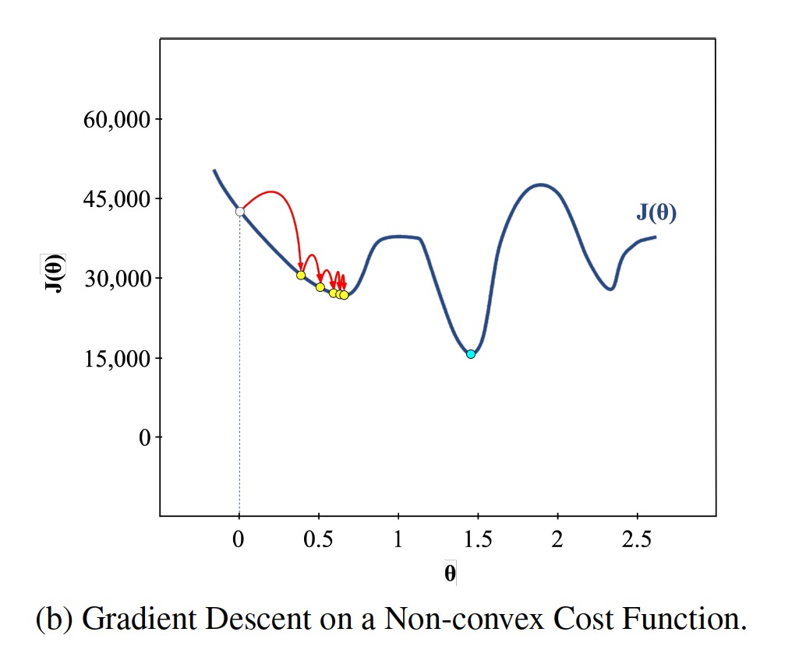

# Machine Learning Simplified

1. AI > Machine Learning > Supervised Machine Learning (predict a categorical target variable or a numerical target variable) + UnSupervised Machine Learning + Deep Learning and Neural Nets + Reinforcement Learning + Ensemble Methods 
2. Supervised Machine Learning: to make predictions about unknown quantities given known quantities, such as predicting a house's sale price based on its location and square footage. Supervised ML does this by learning from, or discovering patterns in, past data. 
3. Classfication problems: try to predict an unknown category, called a class label based on a set of known, or bserved, variables. For instance, any yes-no questions.
    - Yes or no questions, is a new email spam or not.
    - Multiclass, is an unknown fruit an apple, a mandarin or a lemon. 
5. Regression problems: predict an unknown number based on a set of known, or observed, variables. 
    - What would be the unknown price of a house given a set of observed measurements about size, number of rooms, crime rate in the neighbourhood.
    - How many customers will come to our restaurant next Saturday.
6. Deep Learning: are very complex supervised/unsupervised ML models that perform very complicated tasks in areas where more advanced or faster analysis is required. They have produced impressive results on image recognition tasks. They are not universally better than other ML methods, required huge amounts of training data, computational cost, a lot of tinkering. In many cases, simpler and traditional ML models actually perform better. 
7. Unsupervised Learning: solves a complementary set of problems to supervised ML that do not require human input labels and generate distinctive groups or clusters of data points. 
8. Data extraction -> Data Preparation -> Model Building -> Model Deployment

10. Overfit: Although you got a very low error on the training set(0% wrong) you got a higher error on the test set(60% wrong). so we need controlling model complexity, 
11. Underfit: learning a trivially simple model, use not enough data or features, get roughly the same score for training and test.

11. Hyperparameters are parameters of a machine learning model that are not learned from data, but are set before training and can significantly affect the model's performance. Examples include learning rate, regularization strength, number of hidden layers in a neural network, number of decision trees in a random forest, kernel type and parameter values in support vector machines, etc.
12. A **residual** is the difference between the observed value and the value that the model predicts for that observation. residual = observed value - predict Value
13. Gradient Descent Algorithm:
    1. Sum of Squared Residuals(SSR) = r1^2 + r2^2 + ....
    2. The best model produced the lowest value of the cost function, minCost = min(r1^2 + r2^2 + ... rn^2) = min((observedValue1 - predictValue1)^2 + (observedValue2 - predictValue2)^2 + ... (observedValueN - predictValueN)^2)
    3. Caluclate the derivative of the cost function (对cost function求导。假设参数只有a)
    
    
    5. Initializes the parameter a = 0, the slope of the curve = derivativeCostFunction(0)
    6. a-new = a-current - derivativeCostFunction(0) * learning rate
    7. Step Size = derivativeCostFunction(0) * learning rate, when step size is super small or close to zero, stop the learning. 
    
    
    
    8. Non-differentiable functions:
    
        
    9. Multiple parameteres costing function("a" and "b")
    
    
14. Selecting a complex model and overfitting on the training data can still cause poor performance on the test data, even if you have large and diverse training data. Overfitting occurs when a model learns the noise or random fluctuations in the training data, rather than the underlying patterns or relationships. As a result, the model may perform very well on the training data, but poorly on new, unseen data. While having a large and diverse training dataset can help to reduce the risk of overfitting, it is not a guarantee. In fact, a complex model may be more likely to overfit on a large dataset, as it has more capacity to memorize noise and random fluctuations. To avoid overfitting, it is important to use regularization techniques such as early stopping, dropout, or weight decay. These techniques can help to prevent the model from memorizing noise and improve its ability to generalize to new data.
15. Unbalanced data, distort prediction, for example, less data for expensive house, below are couple ways to deal with it:
    1. Collect more data
    2. Undersampling majority class, oversampling minority class
    3. Cost-sensitive learning, assign different costs to misclassifying samples in each class
    4. Ensemble method, combine multiple models
    5. Algorithm-specific techniques: decision trees and SVM can deal with imbalanced data. 
