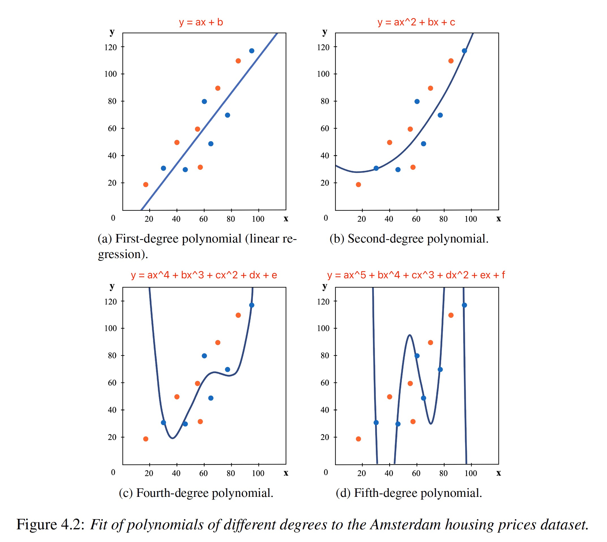

# Machine Learning Simplified

1. AI > Machine Learning > Supervised Machine Learning (predict a categorical target variable or a numerical target variable) + UnSupervised Machine Learning + Deep Learning and Neural Nets + Reinforcement Learning + Ensemble Methods 
2. Supervised Machine Learning: to make predictions about unknown quantities given known quantities, such as predicting a house's sale price based on its location and square footage. Supervised ML does this by learning from, or discovering patterns in, past data. 
3. Classfication problems: try to predict an unknown category, called a class label based on a set of known, or bserved, variables. For instance, any yes-no questions.
    - Yes or no questions, is a new email spam or not.
    - Multiclass, is an unknown fruit an apple, a mandarin or a lemon. 
5. Regression problems: predict an unknown number based on a set of known, or observed, variables. 
    - What would be the unknown price of a house given a set of observed measurements about size, number of rooms, crime rate in the neighbourhood.
    - How many customers will come to our restaurant next Saturday.
6. Deep Learning: are very complex supervised/unsupervised ML models that perform very complicated tasks in areas where more advanced or faster analysis is required. They have produced impressive results on image recognition tasks. They are not universally better than other ML methods, required huge amounts of training data, computational cost, a lot of tinkering. In many cases, simpler and traditional ML models actually perform better. 
7. Unsupervised Learning: solves a complementary set of problems to supervised ML that do not require human input labels and generate distinctive groups or clusters of data points. 
8. Data extraction -> Data Preparation -> Model Building -> Model Deployment

10. Overfit: Although you got a very low error on the training set(0% wrong) you got a higher error on the test set(60% wrong). so we need controlling model complexity, 
11. Underfit: learning a trivially simple model, use not enough data or features, get roughly the same score for training and test.

11. Hyperparameters are parameters of a machine learning model that are not learned from data, but are set before training and can significantly affect the model's performance. Examples include learning rate, regularization strength, number of hidden layers in a neural network, number of decision trees in a random forest, kernel type and parameter values in support vector machines, etc.
12. A **residual** is the difference between the observed value and the value that the model predicts for that observation. residual = observed value - predict Value
13. Gradient Descent Algorithm:
    1. Sum of Squared Residuals(SSR) = r1^2 + r2^2 + ....
    2. The best model produced the lowest value of the cost function, minCost = min(r1^2 + r2^2 + ... rn^2) = min((observedValue1 - predictValue1)^2 + (observedValue2 - predictValue2)^2 + ... (observedValueN - predictValueN)^2)
    3. Caluclate the derivative of the cost function (对cost function求导。假设参数只有a)
    
    
    5. Initializes the parameter a = 0, the slope of the curve = derivativeCostFunction(0)
    6. a-new = a-current - derivativeCostFunction(0) * learning rate
    7. Step Size = derivativeCostFunction(0) * learning rate, when step size is super small or close to zero, stop the learning. 
    
    
    
    8. Non-differentiable functions:
    
        
    9. Multiple parameteres costing function("a" and "b")
    
       
14. Basis Expansion: liner regression -> second-degree polynomial -> third-degree... this produces a more complex model and may overfit the data.
15. Model weight: f(x) = w0 * x^4 + w1 * x^3 + w2 * x^2 + w3 * x + w4 => sum(w) = |w0| + |w1| + |w2| + |w3| + |w4| , As we can see, the sum of coefficients increase with the increase in model complexity. The higher-degree polynomial would have more weight terms added that the lower-degree.
16. Regularization: technique to decrease the complexity of a model. Puts a constraint on the sum of weights in order to keep the weights small, constructs a penalized loss function. 
    1. Ridge Regression(L2 regularized regression): cost function = min(SSR) + J * (w0^2 + w1^2 + w2^2 + ...) -> L2 penalty term, keep weights small
    2. Lasso Regression(L1 regularized regression): cost function = min(SSR) + J * (|w0| + |w1| + |w2| + ...)
      
    3. Difference between L1 and L2, L1 shrinks many coefficients to be exactly 0 and produces a sparse model.
      
17. In machine learning, a sparse model is a model that has a small number of non-zero coefficients or parameters. In other words, a sparse model is one where only a subset of the input features or variables are used to make predictions, while the rest are effectively ignored.A sparse model is desirable in many situations because it can be simpler, more interpretable, and more computationally efficient than a dense model, which uses all input features. Sparse models can also help to prevent overfitting, where a model fits too closely to the training data and does not generalize well to new data. Sparse models are commonly used in applications such as feature selection, where the goal is to identify the most important input features or variables for a particular task, and compressive sensing, where the goal is to reconstruct a signal from a small number of measurements. L1 regularization (also known as Lasso regularization) is a commonly used technique for producing sparse models in machine learning. By adding an L1 penalty term to the model's cost function, L1 regularization encourages many of the model's coefficients to be exactly zero, effectively selecting a small subset of the input features or variables.
18. Model selection challenge is to select a model that is complex enough to capture the details of the training data but not too complex that is (nearly) memorizes the data.
19. Error = Irreducible Error + Reducible Error = Irreducible Error + (Bias Error + Variance Error)
    1. Irreducible error: noise in the labels, no model can reduce
    2. Reducible error: our choice of model, hyperparameters
    3. Bias Error: the average error over different training sets, can be decreased by making model more complex, better features or new features, indicates the extent to which the model **underfits** the data.
    4. Variance error: how sensitive the model is to randomness in the training set, can be decreased by collecting and labling more training data, drop irrelevant features, indicates the extent to which the model **overfits** the data.
     
20. Validation Methods
     
    1. The cross-validation methods generally produce better estimates of generalization error at the expense of increased computational cost.
    2. The hold out validation has two shortcomings for small datasets, losing data for model training, skewed training and test sets. 
     
21. Feature Selection
    1. Filter methods: identify irrelevant features based solely on the features, a feature that has the same value for each data point has no predictive value, a feature with many similar values(low variance) will probably have low predictive power.
        1. Univariate score: A relevance score can be computed for each feature individually without looking at other features.
            1. Variance score: (x_1 - x_avg) ^ 2)  + (x_2 - x_avg) ^ 2 + .... (x_n - x_avg) ^ 2 / n, if all values were identical, the variance would be zero. provide no information.
            2. Chi-squared score: to test the independence of two events. we are interested in testing the independence between a feature variable and the target variable.
        2. Multivariate score: looks at interactions among features, to remove features that are highly correlated with each other.
            1. Correlation-based feature selection
            2. Fisher Score
    3. Search methods: identify features that are directly relevant to the prediction problem. Define a search for the K best features outside of the specific learning algorithm. Out of all possible sets of K features, find the set of K features that gives the best performance.
    4. Embedded Methods: utilize prediction accuracy to select features, they do so within the algorithm, add a penalized learning objective that auto does feature selection. e.g. L1-penalized linear regress.
23. Selecting a complex model and overfitting on the training data can still cause poor performance on the test data, even if you have large and diverse training data. Overfitting occurs when a model learns the noise or random fluctuations in the training data, rather than the underlying patterns or relationships. As a result, the model may perform very well on the training data, but poorly on new, unseen data. While having a large and diverse training dataset can help to reduce the risk of overfitting, it is not a guarantee. In fact, a complex model may be more likely to overfit on a large dataset, as it has more capacity to memorize noise and random fluctuations. To avoid overfitting, it is important to use regularization techniques such as early stopping, dropout, or weight decay. These techniques can help to prevent the model from memorizing noise and improve its ability to generalize to new data.
24. Unbalanced data, distort prediction, for example, less data for expensive house, below are couple ways to deal with it:
    1. Collect more data
    2. Undersampling majority class, oversampling minority class
    3. Cost-sensitive learning, assign different costs to misclassifying samples in each class
    4. Ensemble method, combine multiple models
    5. Algorithm-specific techniques: decision trees and SVM can deal with imbalanced data. 
